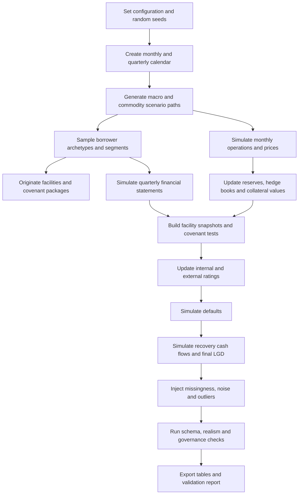

# Synthetic Credit Dataset Design for a Shell Like Oil and Gas Portfolio

## Executive summary

The exact company name is **unspecified**, so the right design target is not a literal Shell replica but a **Shell-like integrated supermajor archetype** embedded in a wider oil and gas credit portfolio. Public Shell disclosures are useful calibration anchors because they show the scale, cyclicality, balance-sheet posture, reserve base, decommissioning burden, commodity exposure, and credit profile that a realistic integrated energy borrower can exhibit. In 2025, Shell reported cash flow from operations of **$42.9 billion**, cash capital expenditure of **$20.9 billion**, long-term ratings of **A+ / Aa2 / AA-**, and indicated that it aims to maintain a strong investment-grade rating through the cycle. Its 2025 SEC proved reserves position was **8.1 billion boe** excluding synthetic crude oil reserves, with a reserves life of **7.8 years**; its decommissioning and restoration provision was **$34 billion undiscounted** and **$19 billion discounted** at year-end 2025. Shell also disclosed that a **±10%** change to its mid-price outlook across the life of assets would imply material impairment swings in Integrated Gas and Upstream. These are exactly the kinds of magnitudes a synthetic dataset should be able to represent for large integrated names. citeturn7search10turn44search0turn22view1turn21view0turn40view0

For credit analytics, the recommended dataset is a **hybrid monthly-quarterly panel**. Monthly granularity is needed for exposure utilisation, collateral values, hedge roll-off, covenant headroom, rating migration, margin calls, and commodity/macro shocks. Quarterly granularity is more realistic for published financial statements, reserve engineering updates, capex planning, and decommissioning updates. This choice is also aligned with supervisory practice: reserve-based energy lending guidance explicitly emphasises commodity prices, production costs, capital expenditure, cash-flow sensitivity, hedges, and updated reserve engineering reports; prudential PD and LGD guidance requires calibration to long-run default and loss experience, with downturn conservatism where relevant. citeturn37view1turn16view0

A robust synthetic design should support four primary use cases at once: **credit scoring**, **PD/LGD modelling**, **stress testing**, and **portfolio monitoring**. The most effective architecture is a relational schema that separates borrower master data, facility terms, monthly exposure snapshots, transactions, covenants, ratings, defaults, recoveries, and macro or commodity scenario tables. Defaults should be generated from a **hybrid reduced-form and structural framework**: leverage, liquidity, profitability, coverage, rating momentum, covenant pressure, reserves life, hedge coverage, and common macro or commodity factors should all matter, consistent with corporate default literature. Recoveries should then depend on collateral coverage, facility seniority, reserve quality, borrower quality, decommissioning burden, and the macro state because recoveries empirically worsen in recessions and sector distress. citeturn30view3turn31search6turn35view0turn35view1

The recommended baseline configuration is **4,000 borrowers**, about **12,000 facilities**, **120 monthly periods**, and **40 quarterly periods**, with enough distressed names to generate a statistically useful default and recovery sample without making the data unwieldy. The dataset should deliberately include realistic imperfections: filing lags, reserve revisions, partial hedge disclosure, outliers from unit conversion errors, and non-random missingness concentrated in smaller and private names. Validation then has to go beyond schema checks: accounting identities, monotonic rating-to-PD ordering, stressed PD-LGD dependence, secured-versus-unsecured recovery ordering, and segment-specific commodity sensitivities should all be tested under a formal model-risk and stress-testing framework. citeturn25view0turn25view1turn37view1

## Calibration anchors and use cases

A Shell-like integrated major is not only “large”; it is structurally different from smaller upstream, midstream, refining, or services names. The portfolio therefore needs **segment heterogeneity**, not one generic corporate template. Shell’s public disclosures highlight several anchor features that should shape the synthetic design: large operating cash flow, large but disciplined capex, sizeable proved reserves, material decommissioning liabilities, commodity-linked earnings, active use of commodity derivatives to mitigate economic exposures in parts of the business, and a strong investment-grade target. Reserve-based lending guidance adds the lender’s perspective: the credit process should review production assumptions, price differentials, capital needs, hedges, reserve reports, borrowing-base support, and liquidity tests. citeturn22view1turn22view2turn40view0turn42view0turn37view1

The current official macro and energy backdrop also matters if the dataset will be used for scenario design. The IMF’s April 2026 baseline projects **3.1% global growth in 2026** and **3.2% in 2027** under a limited-conflict assumption, while the EIA’s May 2026 Short-Term Energy Outlook projects Brent at **$95/bbl in 2026** and **$79/bbl in 2027**, with Henry Hub around **$3.50/MMBtu in 2026** and **$3.18/MMBtu in 2027**. The Federal Reserve’s 2026 severely adverse scenario is materially harsher, with U.S. unemployment peaking at **10%**, real GDP declining **4.6%** from late 2025 to mid-2027, and BBB corporate spreads widening sharply. World Bank commodity work points in the same direction: commodity and energy prices remain highly shock-sensitive in 2026. A synthetic dataset should therefore include both **baseline** and **severe adverse** macro layers, plus energy-specific overlays such as geopolitical supply shocks and transition or carbon shocks. citeturn38view1turn38view2turn24view0turn39view0

The use-case design is straightforward:

| Use case | What the dataset must support | Core labels and outputs | Minimum useful granularity |
|---|---|---|---|
| Credit scoring | Origination and annual review | Internal score, rating bucket, early-warning flags | Quarterly financials plus monthly market state |
| PD modelling | TTC/PIT one-year PD, lifetime PD, rating migration | Default label, default date, hazard path, rating path | Monthly borrower and facility states |
| LGD modelling | Workout LGD, downturn LGD, ELBE-style paths | Recovery cash flows, collateral realisation, resolution time | Monthly recoveries plus facility terms |
| Stress testing | Scenario EL, capital and earnings impact | Scenario-specific PD, LGD, EAD, impairment and migration | Monthly scenario paths, quarterly financial closes |
| Portfolio monitoring | Watchlists, concentration, covenant surveillance | Breach history, utilisation, sector heat maps | Monthly snapshots and covenant test dates |

The design choice on time granularity is not trivial. A compact comparison is below.

| Design choice | Strength | Weakness | Best use |
|---|---|---|---|
| Quarterly only | Small, simple, easy to explain | Misses hedge roll-off, borrowing-base drift, margin calls, covenant cures | Accounting-led prototyping |
| Monthly only | Best for dynamic analytics | Unrealistic for many corporate statement items; too noisy if everything is monthly | Trading-heavy portfolios |
| Hybrid monthly and quarterly | Most realistic for corporate energy credit | Slightly more complex ETL and validation | **Recommended** |

The same is true for sample size.

| Scale | Borrowers | Facilities | Horizon | Expected purpose |
|---|---|---:|---:|---|
| Lite | 1,000 | 3,000 | 36 months | Pipeline testing, dashboards |
| Standard | 4,000 | 12,000 | 120 months | **Recommended** for PD/LGD and stress |
| Research grade | 15,000+ | 45,000+ | 120–180 months | Model benchmarking, challenger models, simulation studies |

These tables are **proposed design choices**, not historical facts. They are calibrated to Shell-scale disclosures, oil and gas lending guidance, and standard prudential modelling requirements. citeturn7search10turn21view0turn40view0turn37view1turn16view0

## Schema and design choices

The most practical structure is a **star-like relational model** with a few slowly changing dimension tables and several periodic fact tables. Separating borrower-level, facility-level, and event-level facts avoids duplicated attributes and makes it easier to validate time consistency.

### Core master and reference tables

| Table | Grain | Key fields | Suggested Python dtypes |
|---|---|---|---|
| `borrower_dim` | one row per borrower | `borrower_id`, `legal_name`, `segment`, `subsegment`, `country`, `region`, `ownership_type`, `listed_flag`, `fiscal_year_end_month`, `shell_like_flag`, `inception_date`, `exit_date` | `string`, `category`, `boolean`, `datetime64[ns]`, `Int8` |
| `counterparty_dim` | one row per counterparty | `counterparty_id`, `counterparty_type`, `sector`, `country`, `external_rating`, `wrong_way_risk_flag`, `connected_party_flag` | `string`, `category`, `boolean` |
| `facility_dim` | one row per facility | `facility_id`, `borrower_id`, `facility_type`, `currency`, `secured_flag`, `seniority`, `origination_date`, `maturity_date`, `commitment_usd_m`, `spread_bps`, `rate_type`, `benchmark`, `guarantor_id`, `borrowing_base_flag`, `collateral_type` | `string`, `category`, `float64`, `datetime64[ns]`, `boolean`, `Int32` |
| `covenant_def_dim` | one row per covenant definition | `covenant_id`, `facility_id`, `test_name`, `test_formula`, `threshold_operator`, `threshold_value`, `frequency`, `cure_days`, `waiver_allowed_flag` | `string`, `category`, `float64`, `Int16`, `boolean` |

### Borrower and market history tables

| Table | Grain | Key fields | Suggested Python dtypes |
|---|---|---|---|
| `borrower_financials_q` | borrower-quarter | `borrower_id`, `as_of_quarter`, `revenue_usd_m`, `ebitda_usd_m`, `ebit_usd_m`, `cfo_usd_m`, `capex_usd_m`, `interest_expense_usd_m`, `tax_paid_usd_m`, `cash_usd_m`, `gross_debt_usd_m`, `net_debt_usd_m`, `total_assets_usd_m`, `total_equity_usd_m`, `working_capital_usd_m`, `inventory_usd_m`, `receivables_usd_m`, `decommissioning_prov_disc_usd_m`, `decommissioning_prov_undisc_usd_m`, `leases_usd_m` | numeric financial fields as `float64`; date as `datetime64[ns]` |
| `borrower_operations_m` | borrower-month | `borrower_id`, `as_of_month`, `liq_prod_kboed`, `gas_prod_mmscfd`, `total_prod_kboed`, `realised_oil_price_usd_bbl`, `realised_gas_price_usd_mmbtu`, `refining_margin_usd_bbl`, `chemical_margin_usd_tonne`, `lifting_cost_usd_boe`, `planned_maintenance_days`, `unplanned_outage_days`, `spill_count`, `scope1_2_ktco2e` | `float64`, `Int16` |
| `reserves_q` | borrower-quarter | `borrower_id`, `as_of_quarter`, `proved_reserves_mmboe`, `pdp_mmboe`, `pdnp_mmboe`, `pud_mmboe`, `reserve_life_years`, `rrr_pct`, `reserve_revision_mmboe`, `offshore_share_pct`, `mature_asset_share_pct`, `engineer_report_date`, `independent_engineer_flag` | `float64`, `datetime64[ns]`, `boolean` |
| `hedge_position_m` | hedge line-month | `hedge_id`, `borrower_id`, `counterparty_id`, `commodity`, `instrument_type`, `start_date`, `end_date`, `notional_boe_or_mmbtu`, `fixed_price`, `floor_price`, `cap_price`, `hedged_pct_next_12m_prod`, `mtm_usd_m` | `string`, `category`, `float64`, `datetime64[ns]` |
| `rating_history_m` | borrower-month-agency | `borrower_id`, `as_of_month`, `agency`, `external_rating`, `outlook`, `watch_flag`, `internal_grade`, `internal_pd_1y` | `string`, `category`, `boolean`, `float64` |
| `macro_scenario_m` | month-scenario | `scenario_id`, `as_of_month`, `global_gdp_yoy`, `us_gdp_yoy`, `eu_gdp_yoy`, `uk_gdp_yoy`, `unemployment_us`, `bbb_spread_bps`, `policy_rate_bps`, `brent_usd_bbl`, `henry_hub_usd_mmbtu`, `ttf_usd_mmbtu`, `jkm_usd_mmbtu`, `carbon_price_usd_tco2`, `usd_index`, `shipping_cost_index` | `category`, `datetime64[ns]`, `float64` |

### Facility state, events and outcomes

| Table | Grain | Key fields | Suggested Python dtypes |
|---|---|---|---|
| `facility_snapshot_m` | facility-month | `facility_id`, `as_of_month`, `drawn_usd_m`, `undrawn_usd_m`, `utilisation_pct`, `ead_usd_m`, `interest_rate_all_in_bps`, `collateral_value_usd_m`, `collateral_coverage_x`, `borrowing_base_usd_m`, `dpd_days`, `accrual_status`, `stage_ifrs9`, `watchlist_flag` | `float64`, `Int16`, `category`, `boolean` |
| `transaction_fact` | transaction | `txn_id`, `facility_id`, `borrower_id`, `txn_date`, `txn_type`, `amount_usd`, `currency`, `commodity_ref`, `settlement_status`, `days_to_settle` | `string`, `datetime64[ns]`, `category`, `float64`, `Int16` |
| `covenant_test_fact` | covenant test date | `facility_id`, `covenant_id`, `test_date`, `measured_value`, `headroom_pct`, `breach_flag`, `waiver_flag`, `cure_end_date`, `breach_severity` | `float64`, `boolean`, `datetime64[ns]`, `category` |
| `default_event_fact` | default event | `default_id`, `borrower_id`, `facility_id`, `default_date`, `default_type`, `dpd_90_flag`, `utp_flag`, `bankruptcy_flag`, `distressed_restructuring_flag`, `reason_code`, `default_ead_usd_m` | `string`, `datetime64[ns]`, `boolean`, `category`, `float64` |
| `recovery_cashflow_fact` | recovery period | `default_id`, `facility_id`, `recovery_date`, `gross_recovery_usd_m`, `workout_cost_usd_m`, `net_recovery_usd_m`, `discount_rate_bps`, `collateral_realisation_source`, `resolution_status`, `final_lgd` | `datetime64[ns]`, `float64`, `category` |

This schema is intentionally broad enough to support both bank-style IRB analytics and portfolio surveillance. The regulatory reason is clear: PD and LGD estimation needs a defined reference dataset, long-run calibration, distinct treatment of defaulted exposures, and sufficient documentation; stress testing guidance requires governance, methodology, data, and documentation strong enough to support both internal and supervisory use. citeturn16view0turn25view0turn25view1

## Generative rules and scenarios

The dataset should be generated in layers: **calendar and scenarios**, **borrower archetypes**, **facilities**, **time-series financial and operational states**, **covenants and ratings**, **defaults**, **recoveries**, then **data-quality noise**. That order matters because oil and gas credit is strongly causal: commodity and macro shocks move production economics, operating cash flow, borrowing-base support, and rating pressure; those then move PD, covenant headroom, LGD, and portfolio loss. Fed energy-lending guidance is explicit that commodity prices, production levels, capital expenditure, hedges, reserve valuation, and liquidity all affect repayment capacity. Academic default models point in the same direction: leverage, profitability, size, equity returns or volatility, and macro conditions are the most useful default drivers. citeturn37view1turn30view3turn31search6

### Borrower segments and starting parameters

A practical segmentation is below.

| Segment | Portfolio share | Revenue median | Target leverage median | Reserve-life median | Hedge ratio median |
|---|---:|---:|---:|---:|---:|
| Supermajor | 0.5% | USD 300bn | 1.2x debt/EBITDA | 8.5y | 12% |
| Large integrated | 3.5% | USD 55bn | 1.8x | 9.0y | 15% |
| Independent upstream | 32.0% | USD 4bn | 2.8x | 7.0y | 48% |
| Midstream and LNG | 12.0% | USD 5.5bn | 3.6x | 10.0y | 25% |
| Refining and marketing | 10.0% | USD 8.5bn | 2.1x | n/a | 20% |
| Oilfield services | 23.0% | USD 1.8bn | 2.5x | n/a | 5% |
| Trading and petrochemicals | 19.0% | USD 3.2bn | 2.0x | n/a | 18% |

These values are the **report’s recommended starting calibration**, not observed market data. The logic is anchored to three features visible in public sources: first, Shell-like integrated names operate at very large scale and strong ratings; second, reserve-based upstream borrowers face materially higher direct commodity dependence and hedge use; third, reserve, capex, and decommissioning variables matter operationally and credit-wise. citeturn44search0turn21view0turn40view0turn37view1

### Core synthetic equations

A workable monthly-quarterly design uses the following structure.

For revenue or gross cash inflow:
```text
ln(Revenue_i,t) = ln(Revenue_i,t-1)
                + μ_segment
                + β_oil,segment * Δln(Brent_t)
                + β_gas,segment * Δln(Gas_t)
                + β_gdp,segment * GDP_t
                + ε_i,t
```

For EBITDA:
```text
EBITDA_i,t = Revenue_i,t * Margin_i,t
Margin_i,t = clip(
    Margin_i,t-1
    + θ1 * price_realisation_shock
    - θ2 * lifting_cost_shock
    - θ3 * maintenance_outage_ratio
    - θ4 * inflation_shock
    + ν_i,t
)
```

For reserves:
```text
ProvedReserves_i,q = ProvedReserves_i,q-1
                   - Production_i,q
                   + ExtensionsDiscoveries_i,q
                   + AcquisitionsDivestments_i,q
                   + NetRevisions_i,q
```

For decommissioning:
```text
DecommProv_i,q = BaseRate_basin * DevelopedReserves_i,q
               * OffshoreFactor_i
               * MaturityFactor_i
               * DiscountFactor_q
```

For one-year PIT PD:
```text
logit(PD1Y_i,t) = α_segment
                + 0.85 * z(Leverage_i,t)
                - 0.95 * z(InterestCoverage_i,t)
                - 0.50 * z(CashRatio_i,t)
                + 0.25 * z(DecommBurden_i,t)
                - 0.20 * z(ReserveLife_i,t)
                - 0.30 * HedgeRatio_i,t
                - 0.40 * CovenantHeadroom_i,t
                + 0.50 * z(BBBspread_t)
                - 0.55 * z(GDP_t)
                - 0.80 * BetaCommodity_i * z(Brent_t)
                + borrower_random_effect
                + time_random_effect
```

For default simulation:
```text
MonthlyHazard_i,t = 1 - exp(-PD1Y_i,t / 12)
Default_i,t ~ Bernoulli(MonthlyHazard_i,t)
```

For recovery rate:
```text
logit(RR_j) = γ0
            + γ1 * CollateralCoverage_j
            + γ2 * Seniority_j
            + γ3 * PDPshare_j
            + γ4 * HedgeCoverage_j
            - γ5 * DecommBurden_j
            - γ6 * BBBspread_t
            - γ7 * IndustryDefaultRate_t
            - γ8 * ResolutionTime_j
            + ω_j
LGD_j = 1 - RR_j
```

These functional forms are consistent with structural and reduced-form default literature and with recovery evidence showing that recoveries worsen when defaults and macro stress rise. They also align with prudential guidance that PD should map to long-run average default rates, LGD to long-run or downturn LGD, and ELBE or LGD-in-default to post-default recovery information. citeturn30view3turn31search6turn35view0turn35view1turn16view0

### Industry-specific variable rules

A Shell-like or integrated energy borrower should not be modelled with generic industrial-company variables alone. At minimum, the synthetic generator should create:

| Variable family | Proposed distribution or rule | Why it matters |
|---|---|---|
| Production volumes | Lognormal by segment; AR process with field decline and planned capex responsiveness | Directly drives upstream cash flow and reserve depletion |
| Proved reserves and reserve mix | Quarterly stock-flow identity; PDP, PDNP, PUD split | Matters for collateral quality, reserve life, and borrowing bases |
| Lifting costs | Basin and segment-specific normal/lognormal with inflation pass-through | OCC/Fed guidance explicitly stresses production or lifting costs |
| Commodity hedges | Beta distribution by segment, lower for supermajors and higher for independents | Stabilises realised cash flow and collateral values |
| Commodity price exposure | Segment-specific betas to Brent, gas hubs, crack spread, chemical margins | Necessary for realistic stress transmission |
| Capex | Quarterly, partly commitment-driven, partly discretionary; positive relation to reserve replacement | Strong causal link to production sustainability and leverage |
| Decommissioning liabilities | Positive, long-dated, increasing with mature offshore and developed reserve share | Real balance-sheet burden in energy portfolios |
| Borrowing-base support | Derived from PDP value, discount rates, hedge protection and reserve reports | Core for RBL facilities |

Fed guidance on reserve-based lending is unusually explicit here. It calls out **production costs or lifting costs**, **capital expenditure**, **price sensitivity analysis**, **hedges in place**, **updated reserve engineering reports typically twice a year**, and covenant structures including forward-looking liquidity tests and lender approval before lifting hedges used to support collateral values. citeturn37view1

### Illustrative distributions

The chart below is not sampled from Shell; it is generated from the **proposed synthetic parameterisation** and shows the kind of segment-level leverage separation the dataset should exhibit.


Correlations also need to look economically sensible. In a good synthetic dataset, leverage should correlate positively with PD, cash ratio and interest coverage should correlate negatively with PD, collateral coverage should support recovery, and hedge coverage should partly cushion commodity shocks. The chart below shows an illustrative correlation structure from one seeded simulation generated under these rules.


### Scenario set

The macro and commodity scenario table should combine generic banking stress variables with energy-specific shocks.

| Scenario | Calibration anchor | Synthetic overlay |
|---|---|---|
| Baseline | IMF April 2026 and EIA May 2026 baseline-like path | Use official 2026 anchor levels for growth, spreads, Brent and gas as the initial state |
| Severe demand shock | Fed 2026 severely adverse scenario | Add Brent down **30–40%**, weaker refining and chemical margins, lower equity values, tighter refinancing |
| Geopolitical supply shock | EIA and World Bank 2026 energy-shock context | Brent up **40–60%** for 2–3 quarters, TTF and LNG markers spike, shipping and basis risk widen |
| Disorderly transition shock | Shell climate price sensitivity and transition disclosures | Lower long-run oil and gas price deck, higher carbon cost, earlier decommissioning, asset impairment pressure |

The sources for these anchors are current and clear. IMF and EIA provide baseline macro and commodity paths; the Fed provides a sharply adverse macro-financial scenario; the World Bank documents severe 2026 commodity shock sensitivity; Shell’s own disclosure shows that plausible price-deck shifts and transition price cases materially affect asset values and decommissioning timing. citeturn38view1turn38view2turn24view0turn39view0turn40view0

### Default, recovery, and covenants

Default labels should be applied at the **facility** and **borrower** levels, with the earliest event date flowing up to the obligor. A prudent default framework uses the usual bank criteria: **90+ days past due as a backstop**, plus “unlikely to pay” events such as distressed restructuring, bankruptcy, non-accrual, or acceleration after severe covenant failure. That is consistent with Basel treatment. citeturn45search1

Covenants and event triggers are where the synthetic dataset becomes genuinely useful. A recommended set is below.

| Trigger | Synthetic threshold | Effect in the data |
|---|---|---|
| Net debt / EBITDA breach | segment-specific, e.g. 3.0x integrated, 4.5x midstream, 3.5x services | Increase watchlist flag, widen spread, raise PD |
| Interest cover breach | `< 3.0x` or tighter for weaker credits | Raise rollover risk and covenant pressure |
| Minimum liquidity breach | cash below 6 months of forecast debt service | Trigger early-warning event |
| Borrowing-base deficiency | drawn amount > 100–110% of revised base | Immediate restructuring or cure workflow |
| Reserve report not delivered | 15–30 days late | Freeze availability, add operational risk flag |
| Hedge coverage roll-off | below minimum programme for RBL names | Reduce collateral support and raise PD |
| Rating downgrade | two-notch downgrade in 12 months | Step-up spread and tighten refinancing assumptions |
| Decommissioning shock | liability/equity or liability/EBITDA jump beyond threshold | Raise LGD and refinancing risk |
| Lease-maintenance or operating clause pressure | continuous-drilling or production pressure in weak prices | Raise cash burn and covenant risk |

The exact thresholds above are synthetic design choices, but the **types** of triggers are strongly supported by supervisory energy-lending guidance: liquidity tests, hedges, reserve engineering, collateral support, lease maintenance, and cash-flow sensitivity are all explicitly emphasised. citeturn37view1

## Validation, data quality and governance

A synthetic dataset that merely “looks plausible” is not enough. Prudential guidance requires validation, documentation, and effective challenge. The 2026 U.S. interagency model-risk guidance stresses **risk-based model governance**, **model inventory**, **documentation**, and **effective challenge** by independent experts; Basel stress-testing principles similarly emphasise objectives, governance, methodology, data, documentation, and use. citeturn25view0turn25view1

### Validation tests and realism checks

| Test | Pass condition |
|---|---|
| Accounting identities | `Assets ≈ Liabilities + Equity`; `Net debt = Gross debt - cash ± hedge adjustments`; tolerance < 0.5% |
| Reserve arithmetic | `Reserve life ≈ proved reserves / annual production`; segment-appropriate distributions |
| Commodity signs | Upstream revenue and EBITDA rise with oil and gas prices; refiners do not behave identically |
| Rating monotonicity | Mean PD strictly increases as rating worsens |
| PD-LGD dependence | LGD worsens in severe scenarios and in high-default months |
| Seniority ordering | Secured recoveries > unsecured > subordinated |
| Covenant realism | Breaches concentrate in stressed months and weaker segments |
| Missingness realism | Missingness higher for smaller or private names; not missing completely at random |
| Time leakage check | No variable for period `t` may use data first disclosed in `t+1` |
| Scenario sensitivity | Portfolio EL, default counts and downgrades all rise materially under severe adverse scenarios |

### Data quality injection

The dataset should include **controlled imperfections** because real credit data is messy:

| Issue | Recommended rate | Pattern |
|---|---:|---|
| Late quarterly filings | 3–8% of private names per quarter | More common in smaller upstream and services names |
| Reserve report delay | 5–10% of upstream quarter-ends | More common after sharp commodity moves |
| Partial hedge disclosure | 10–20% of smaller borrowers | Missing floors/caps but not notional |
| Unit conversion outliers | 0.1–0.3% of production rows | boe, bbl, mcf confusion |
| Duplicate transactions | 0.02–0.10% | In payment interfaces and manual uploads |
| Restatement events | 1–3% of financial histories | Retrospective correction flags required |
| Stale ratings | 2–5% | External ratings lag internal deterioration |
| Collateral valuation noise | 5–10% relative error | Larger under stress and for illiquid fields |

Those percentages are design recommendations, not empirical market facts. The important principle is that missingness must be **structural** rather than random. Smaller private borrowers should be noisier and later; operational series should degrade in periods of stress; reserve data should revise after price shocks; and hedge data should be more complete for public and rated names. That makes the synthetic data suitable for challenger testing, missing-data robustness checks, and realistic EWS deployment. The governance reason for doing this is directly supported by model-risk guidance: documentation, traceability, and a risk-based approach are essential. citeturn25view1

## Python implementation and example analyses

The most practical language is **Python**. A clean implementation stack is:

| Purpose | Libraries |
|---|---|
| Core arrays and simulation | `numpy`, `scipy` |
| Tables and joins | `pandas` or `polars` |
| Schema validation | `pandera` |
| Export | `pyarrow`, `duckdb` |
| Modelling checks | `scikit-learn`, `statsmodels` |
| Plots | `matplotlib` |
| Random names and IDs | `faker`, `uuid` |

Use **reproducible random seeds**, with one master seed and deterministic child seeds per layer.

```python
MASTER_SEED = 20260605
SEEDS = {
    "calendar": 20260606,
    "macro": 20260607,
    "borrowers": 20260608,
    "facilities": 20260609,
    "financials": 20260610,
    "operations": 20260611,
    "ratings": 20260612,
    "defaults": 20260613,
    "recoveries": 20260614,
    "dq_noise": 20260615,
}
```

### Runnable script outline

```python
from dataclasses import dataclass
import numpy as np
import pandas as pd
import pandera as pa

@dataclass
class Config:
    n_borrowers: int = 4000
    n_months: int = 120
    start_date: str = "2016-01-31"
    master_seed: int = 20260605
    output_dir: str = "data_out"

def make_calendar(cfg: Config) -> pd.DataFrame:
    months = pd.date_range(cfg.start_date, periods=cfg.n_months, freq="M")
    quarters = months[months.month.isin([3, 6, 9, 12])]
    return pd.DataFrame({"as_of_month": months}), pd.DataFrame({"as_of_quarter": quarters})

def generate_macro_paths(cfg: Config, months: pd.DataFrame) -> pd.DataFrame:
    # AR / scenario-based paths for GDP, BBB spreads, Brent, HH, TTF, carbon, FX
    ...

def generate_borrowers(cfg: Config) -> pd.DataFrame:
    # segment assignment, geography, ownership, listed flag, shell_like flag
    ...

def generate_facilities(cfg: Config, borrowers: pd.DataFrame) -> pd.DataFrame:
    # RBL / revolver / term / bond / trade finance mix
    ...

def simulate_financials_quarterly(borrowers, macro_q) -> pd.DataFrame:
    # revenue, EBITDA, debt, cash, capex, decommissioning, equity
    ...

def simulate_operations_monthly(borrowers, macro_m) -> pd.DataFrame:
    # production, realised prices, margins, outages, lifting costs
    ...

def simulate_reserves_quarterly(ops_m, fin_q) -> pd.DataFrame:
    # proved reserves, PDP/PDNP/PUD, RRR, reserve life, revisions
    ...

def simulate_hedges_monthly(borrowers, ops_m, macro_m) -> pd.DataFrame:
    # hedge programmes, notional, floors/caps, MTM
    ...

def build_facility_snapshots(facilities, fin_q, reserves_q, macro_m) -> pd.DataFrame:
    # drawn, EAD, utilisation, collateral, borrowing base, dpd
    ...

def test_covenants(facility_snapshots, covenant_defs) -> pd.DataFrame:
    # headroom, breach flags, waivers, cure status
    ...

def update_ratings(fin_q, ops_m, cov_tests, macro_m) -> pd.DataFrame:
    # internal grade, external rating transitions, watch flags
    ...

def simulate_defaults(ratings_m, fac_snap_m, cov_tests, macro_m) -> pd.DataFrame:
    # monthly hazard -> default events, Basel-style labels
    ...

def simulate_recoveries(defaults, facilities, fac_snap_m, macro_m) -> pd.DataFrame:
    # recovery timing, collateral sale, costs, final RR / LGD
    ...

def inject_data_quality_noise(*tables) -> tuple:
    # missingness, delays, duplicates, restatements, unit errors
    ...

def validate_tables(*tables) -> None:
    # schema checks, accounting identities, monotonicity, sign checks, leakage tests
    ...

def main():
    cfg = Config()
    months, quarters = make_calendar(cfg)
    macro_m = generate_macro_paths(cfg, months)
    borrowers = generate_borrowers(cfg)
    facilities = generate_facilities(cfg, borrowers)
    fin_q = simulate_financials_quarterly(borrowers, macro_m)
    ops_m = simulate_operations_monthly(borrowers, macro_m)
    reserves_q = simulate_reserves_quarterly(ops_m, fin_q)
    hedges_m = simulate_hedges_monthly(borrowers, ops_m, macro_m)
    fac_snap_m = build_facility_snapshots(facilities, fin_q, reserves_q, macro_m)
    cov_tests = test_covenants(fac_snap_m, ...)
    ratings_m = update_ratings(fin_q, ops_m, cov_tests, macro_m)
    defaults = simulate_defaults(ratings_m, fac_snap_m, cov_tests, macro_m)
    recoveries = simulate_recoveries(defaults, facilities, fac_snap_m, macro_m)
    validate_tables(borrowers, facilities, fin_q, ops_m, reserves_q, fac_snap_m, ratings_m, defaults, recoveries)
    # write parquet

if __name__ == "__main__":
    main()
```

### Generation flow



### Example analyses

The chart below shows an **illustrative PD curve** from one seeded run of the proposed parameterisation. It is not an empirical market curve; it is the output that your synthetic generator should be capable of producing and then tuning.


In that illustrative run, mean one-year base PDs rose monotonically from roughly **0.02%** in the `AAA/AA` bucket to about **16%** in `CCC/C`, with large separation in the middle of the curve. That is the right structural property even if the final numerical calibration is changed for your policy definition, rating philosophy, or target default count.

The stress comparison below shows how expected loss should concentrate in the more commodity-sensitive segments under a severe adverse overlay.


The exact numbers from any single run are less important than the qualitative tests they satisfy:

- stressed PDs rise materially relative to base;
- stressed LGDs worsen rather than staying fixed;
- upstream and related service segments absorb more of the loss than supermajors;
- secured facilities still recover more than unsecured even in stress;
- downgrade and covenant-breach frequencies rise before defaults, not after them.

That is also the right place to compute benchmark diagnostics such as:

```text
PD curve monotonicity
Spearman(rank(rating), PD) < 0 and |rho| > 0.8

Mean recovery ordering
RR(RBL secured) > RR(secured term) > RR(senior unsecured) > RR(subordinated)

Stress amplification
EL_stress / EL_base > 2
Defaults_stress > Defaults_base
Mean_LGD_stress > Mean_LGD_base
```

## Open questions and limitations

The exact company name was **unspecified**, so this report deliberately uses a **Shell-like integrated supermajor archetype**, not a literal reconstruction of one issuer.

Some proposed parameter values are **design choices**, not market statistics. They are intended as realistic starting points that should be tuned to the institution’s default definition, accounting policy, geography, segment mix, and target number of defaults.

The macro and commodity anchors reflect **current official 2026 sources**, which are unusually affected by Middle East conflict assumptions. If the goal is a purely through-the-cycle synthetic dataset rather than a current-environment dataset, the baseline price deck should be normalised before final generation. citeturn38view1turn38view2turn39view0

If the intended use includes IFRS 9 staging, bank regulatory capital, or climate-transition impairment modelling at production-asset level, the dataset should add two more layers not fully specified here: **accounting-policy switches** and **asset-level field economics**. That extension is feasible, but it materially increases model and data complexity.